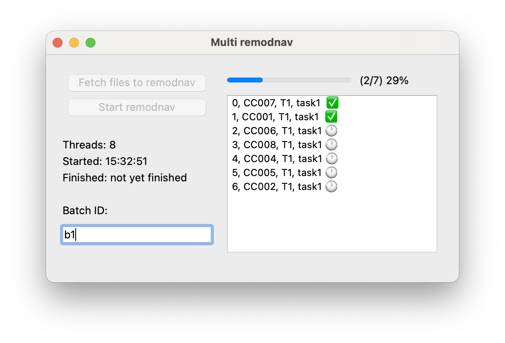
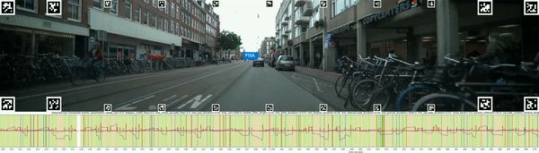

[](https://zenodo.org/doi/10.5281/zenodo.10535678)

# TREYESCAN – Event Classifier v1.0.0

This repo contains the code for event detection from [treyescan/dynamic-aoi-toolkit](https://github.com/treyescan/dynamic-aoi-toolkit). For the classification, a slightly modified version of [psychoinformatics-de/remodnav](https://github.com/psychoinformatics-de/remodnav) is used. Refer to the publication for an explanation of this adaptation. The adapted code can be found in `/remodnav-adapation`.

## Table of Contents

1. [Installation](https://github.com/treyescan/event-classifier?tab=readme-ov-file#installation)
1. [Example Usage](https://github.com/treyescan/event-classifier?tab=readme-ov-file#example-usage)
   1. [Multi REMoDNaV](https://github.com/treyescan/event-classifier?tab=readme-ov-file#1-multi-remodnav)
   1. [Merge REMoDNaV](https://github.com/treyescan/event-classifier?tab=readme-ov-file#2-merge-remodnav)
   1. [Overlay REMoDNaV](https://github.com/treyescan/event-classifier?tab=readme-ov-file#3-overlay-remodnav)
   1. [Single REMoDNaV](https://github.com/treyescan/event-classifier?tab=readme-ov-file#4-single-remodnav)
1. [Adjusting REMoDNaV parameters](https://github.com/treyescan/event-classifier?tab=readme-ov-file#adjusting-remodnav-parameters)
1. [Citation](https://github.com/treyescan/event-classifier?tab=readme-ov-file#citation)
1. [Contribution](https://github.com/treyescan/event-classifier?tab=readme-ov-file#contribution)
1. [License](https://github.com/treyescan/event-classifier?tab=readme-ov-file#license)

## Installation

To use the event classifier, make sure python3 is installed. To install the latest version of this repo, use:

```bash
$ git clone git@github.com:treyescan/gaze-classifier.git

$ cd gaze-classifier

$ pip3 install -m requirements.txt

$ cp __constants.example.py __constants.py
# copy example config file; make sure to edit the variables for your system
```

## Example usage

### 1. Multi REMoDNaV



When classifying gaze, you will mainly use the `multi-remodnav.py`, as this is the most efficient (multi threaded) way to quickly analyse multiple participants or trials.

The script will search in `input_folder` (set in `__constants.py`) for `gp.csv`. These files are the result of [treyescan/dynamic-aoi-toolkit](https://github.com/treyescan/dynamic-aoi-toolkit) and contain processed gaze data from the Pupil Labs Eye Trackers.

> NB: The gaze classifier assumes the same data folder structure as [treyescan/dynamic-aoi-toolkit](https://github.com/treyescan/dynamic-aoi-toolkit). The only difference being that participant ID's are formatted as: CC000. In the code you'll find comments which can be enabled to account for the previous ID format (P-000)

For all found `gp.csv` files:

1. A preperation script will be called (which prepares the data as REMoDNaV requires)
1. The REMoDNaV adaptation will be called and outputs `events.tsv` along with a visual representation of the events in an image
1. A report script will be called (which aggregates data and saves visual representation which help loading data into statistical software, e.g. SPSS)

```bash
$ python3 multi-remodnav.py
```

1. Ensure correct input/output folder locations in `__constants.py`
1. Run `multi-remodnav.py`
1. Set a Batch ID (this ID is used to distinguish between runs)
1. Run multi REMoDNaV
1. If applicable, use `merge-remodnav.py` (see below) to merge outputs

### 2. Merge REMoDNaV

`multi-remodnav.py` runs and outputs gaze events for each trial separately. To simplify analysis in statistical software, `merge-remodnav.py` may be called. Based on a Batch ID, this will aggregrate all trials into a single spreadsheet. Make sure to use the Batch ID you provided when running `multi-remodnav.py`.

```bash
$ python3 merge-remodnav.py --id={batch_id}
Done! 7 files combined to merged_remodnav_{batch_id}.csv
Done! 7 participants combined to merged_remodnav_wide_{batch_id}.csv
```

### 3. Overlay REMoDNaV

To better understand the classified events of single trials, `overlay-remodnav.py` may be used to generate a video such as below:



```bash
python3 overlay-remodnav.py {gp.csv} {events.tsv} {graph.png} {video.mp4} {startframe_nr}
# this will output a video remodnav-overlay-{participant_id}.mp4
```

> Tip: use {startframe_nr} and press Q to only export a part of a video

### 4. Single REMoDNaV

In some cases, a single trial must be processed again for a specific batch. Rather than running `multi-remodnav.py` for all trials, `single-remodnav.py` may be used to rerun the classifier for a single trial.

```bash
$ python3 single-remodnav.py CC066 T1 task1 batch_id
```

## Adjusting REMoDNaV parameters

As can been seen in the [documentation](https://github.com/psychoinformatics-de/remodnav#example-usage), REMoDNaV accepts input parameters. To adjust these parameters, refer to: [multiremodnav/call_remodnav.py](https://github.com/treyescan/event-classifier/blob/e89d1db30df4a290664ab0cc38a4bf1b5cee8b7b/multiremodnav/call_remodnav.py#L45), line 45.

| REMoDNaV Parameter       | TREYESCAN default value |
| ------------------------ | ----------------------- |
| `--min-blink-duration`   | 0.075                   |
| `--dilate-nan`           | 0                       |
| `--savgol-length`        | 21/240                  |
| `--pursuit-velthresh`    | 50.0                    |
| `--noise-factor`         | 3.0                     |
| `--min-pursuit-duration` | 100                     |

## Citation

```
Joris W. van Rijn, & Faraji, Y. (2024). treyescan/event-classifier: v1.0.0 (v1.0.0). Zenodo. https://doi.org/10.5281/zenodo.10535679
```

- DOI V1.0.0: `10.5281/zenodo.10535679`

## Contribution

[Issues](https://github.com/treyescan/event-classifier/issues/new) and other contributions are welcome.

## License

This toolkit is licensed under [GNU GENERAL PUBLIC LICENSE V3](/LICENSE)
